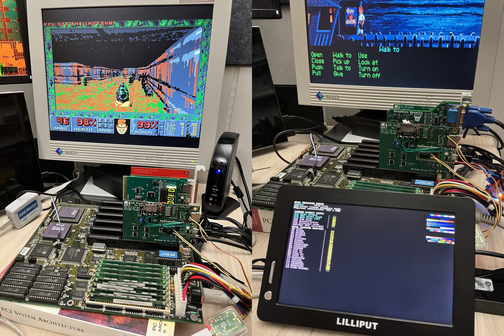

# PicoGraph

PicoGraph is a Pico 2 mounted on a PicoMEM 1.4, running custom firmware that hosts a USB DisplayLink adapter via TinyUSB and emulates PC graphics adapters on the ISA bus. It started out as tooling to snoop and visualize I/O and memory accesses for my FPGA projects, and turned into the first Pico-based ISA video card.

## Modules:

- `EGA`: IBM EGA-compatible emulation based on PCem.
- `HERCULES`: Hercules/MDA text and graphics based on PCem.
- `MDA`: Strict MDA support.
- `REGISTER_VIEW`: passive VGA/MCGA register, POST, and palette display.
- `SAMPLE`: minimal example for I/O traps, memory traps, and write-only snoops.

## DisplayLink/libdlo

This project has a heavily modified version of the libdlo DisplayLink library - first for TinyUSB support a couple of years ago, and later for run-length encoding.
USB 2.0 DisplayLink adapters (DL-1x0 and DL-1x5) are supported.

## License

The software portions of this repository as a collection are licensed under the GNU GPL version 2. Some files are individually dual-licensed under BSD or MIT licenses – see the license in the file headers for details.

Experimental firmware for FreddyV’s [PicoMEM](https://github.com/FreddyVRetro/ISA-PicoMEM) hardware, inspired by Ian Polpo’s [PicoGUS](https://github.com/polpo/picogus) software architecture.